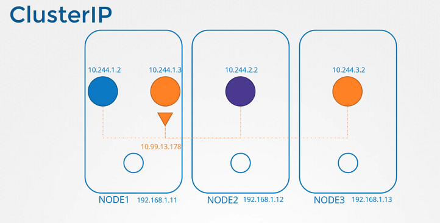
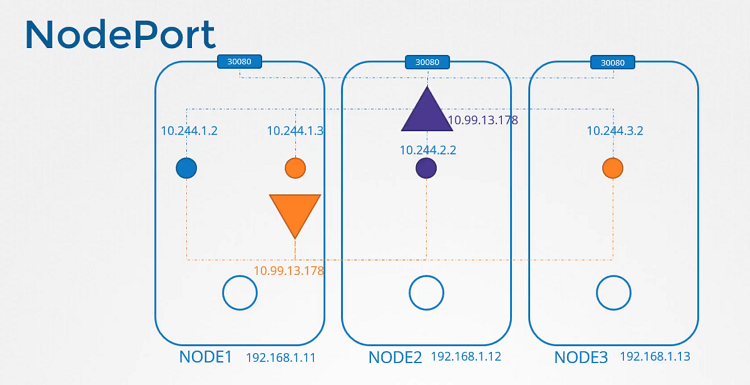

# Service Networking

  - Take me to [Lecture](https://kodekloud.com/courses/certified-kubernetes-administrator-with-practice-tests/lectures/9808291)

In this section, we will take a look at **Service Networking**

## Service Types

- ClusterIP 


```
clusterIP.yaml

apiVersion: v1
kind: Service
metadata:
  name: local-cluster
spec:
  ports:
  - port: 80
    targetPort: 80
  selector:
    app: nginx
```




- NodePort

```
nodeportIP.yaml

apiVersion: v1
kind: Service
metadata:
  name: nodeport-wide
spec:
  type: NodePort
  ports:
  - port: 80
    targetPort: 80
  selector:
    app: nginx
```




#### References Docs

- https://kubernetes.io/docs/concepts/services-networking/service/