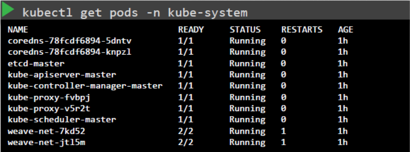
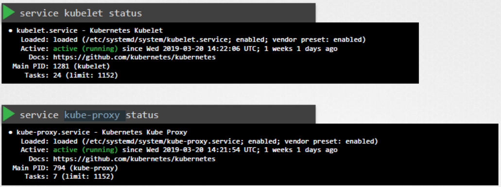
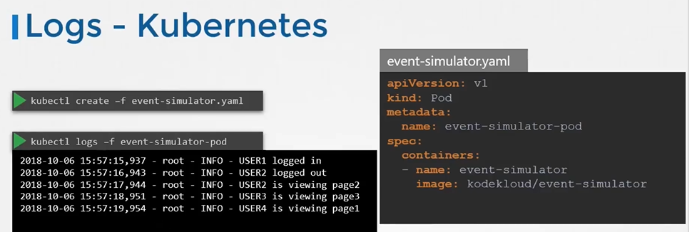

# Control Plane Failure

  - Take me to [Lecture](https://kodekloud.com/topic/control-plane-failure/)
  
  - In this lecture we will use how to troubleshoot the Control Plane components.

  - To check the status of the nodes if they are healthy

    ```
    kubectl get nodes
    ```

  - To check the status of the pods if the are running

    ```
    kubectl get pods
    ```

  - To check the status of all the pods of the Control Plane components(if they are deployed with kubeadm tool) and make sure they are **`Running`**

    ```
    kubectl get pods -n kube-system
    ```

    

  - If the Control Plane components are deployed as services then check the status of all the components

    

  - To check the status of **`kube-apiserver`** 

    ```
    service kube-apiserver status
    ```

  - To check the status of **`kube-controller-manager`** 

    ```
    service kube-controller-manager status
    ```

  - To check the status of **`kube-scheduler`** 

    ```
    service kube-scheduler status
    ```

    

  - To check the status of **`kubelet`** 

    ```
    service kubelet status
    ```

  - To check the status of **`kube-proxy`** on the worker nodes.

    ```
    service kube-proxy status
    ```

  - To check the logs of the Control Plane components deployed as Pods:

    ```
    kubectl logs kube-apiserver-master -n kube-system
    ```

    

  - To check the logs of the Control Plane components deployed as SystemD Service

    ```
    sudo journalctl -u kube-apiserver
    ```


