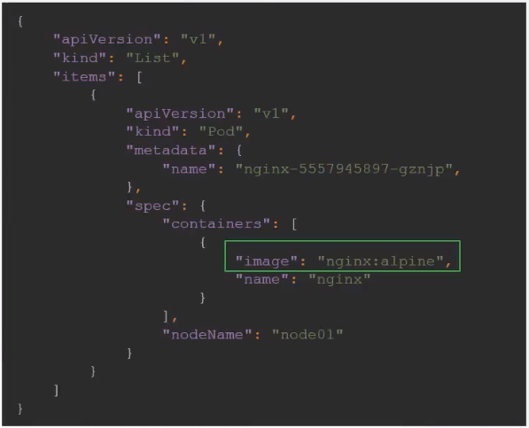
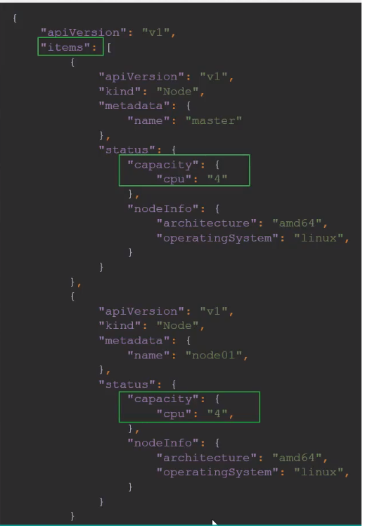
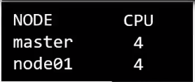

# Advance Kubectl Commands

  - Take me to the [Lecture](https://kodekloud.com/topic/advanced-kubectl-commands/)

  - To get the output of **`kubectl`** in a json format: 

    ```
    kubectl get nodes -o json
    ```

    ```
    kubectl get pods -o json 
    ```

    

  - To get the image name used by pod via json path query:

    ```
    kubectl get pods -o=jsonpath='{.items[0].spec.containers[0].image}'
    ```

  - To get the names of node in the cluster:

    ```
    kubectl get pods -o=jsonpath='{.items[*].metadata.name}'
    ```

    


  - To get the architecture of node in the cluster:

    ```
    kubectl get pods -o=jsonpath='{.items[*].status.nodeInfo.architecture}'
    ```

  - To get the count of the cpu of node in the cluster:

    ```
    kubectl get pods -o=jsonpath='{.items[*].status.status.capacity.cpu}'
    ```

  #### Loops - Range

  - To print the output in a separate column (one column with node name and other with CPU count):

    ```
    kubectl get nodes -o=custom-columns=NODE:.metadata.name ,CPU:.status.capacity.cpu
    ```
    
    

  - Kubectl comes with a **`sort by`** property which can be combined with json path query to **`sort`** by name or **`CPU count`**

    ```
    kubectl get nodes --sort-by=.metadata.name
    ```

    

    ```
    kubectl get nodes --sort-by=..status.capacity.cpu
    ```
