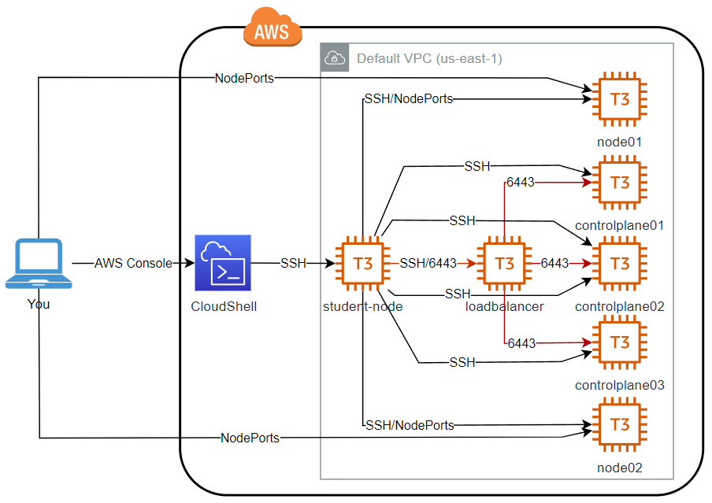

# Kubeadm HA on AWS EC2

This guide shows how to install a 5 node highly-available kubeadm cluster on AWS EC2 instances. If using the KodeKloud AWS Playground environment, please ensure you have selected region `us-east-1` (N. Virginia) from the region selection at the top right of the AWS console. To maintain compatibility with the playground permissions, we will use the following EC2 instance configuration.

* Instance type: `t3.medium`
* Operating System: Ubuntu 22.04 (at time of writing)
* Storage: `gp2`, 8GB

Note that this is an exercise in simply getting a cluster running and is a learning exercise only! It will not be suitable for serving workloads to the internet, nor will it be properly secured, otherwise this guide would be three times longer! It should not be used as a basis for building a production cluster.

# 1. Provision Infrastructure

We will provision the following infrastructure. The infrastructure will be created by Terraform, so as not to spend too much of the lab time just getting that provisioned, and to allow you to focus on the cluster installation.




As can be seen in this diagram, we will create five EC2 instances to form the cluster - 3 control planes and 2 workers, plus one load balancer to provide access to the API server endpoints and a further one `student-node` from which to perform the configuration. We build the infrastructure using Terraform from AWS CloudShell (so you don't have to install Terraform on your workstation), then log into `student-node` which can access the cluster nodes. This relationship between `student-node` and the cluster nodes is similar to CKA Ultimate Mocks and how the real exam works - you start on a separate node (in this case `student-node`), then use SSH to connect to cluster nodes. Note that SSH connections are only possible in the direction of the arrows. It is not possible to SSH from e.g. `controlplane` directly to `node01`. You must `exit` to `student-node` first. This is also how it is in the exam. `student-node` assumes the role of a [bastion host](https://en.wikipedia.org/wiki/Bastion_host).

We will also set up direct connection from your workstation to the node ports of the workers so that you can browse any NodePort services you create (see security below).

Some basic security will be configured:

* Only the `student-node` will be able to access the cluster's API Server, and this is where you will run `kubectl` commands from when the cluster is running.
* Only the `student-node` can SSH to the cluster nodes.
* Ports required by Kubernetes itself (inc. etcd) and Calico CNI will be configured in security groups on the cluster nodes.

Security issues that would make this unsuitable for a genuine production cluster:

* The kube nodes should be on private subnets (no direct access from the Internet) and placed behind a NAT gateway to allow them to download packages, or with a more extreme security posture, completely [airgapped](https://en.wikipedia.org/wiki/Air_gap_(networking)).
* Access to API server and etcd would be more tightly controlled.
* Use of default VPC is not recommended.
* The node ports will be open to the world - i.e. anyone can connect to them.
* A cloud load balancer coupled with an ingress controller would be provisioned to provide ingress to the cluster. It is _definitely_ not recommended to expose the worker nodes' node ports to the Internet as we are doing here!!!

Other things that will be configured by the Terraform code
* Host names set on the nodes: `loadbalancer`, `controlplane01`, `controlplane02`, `controlplane03`, `node01`, `node02`
* Content of `/etc/hosts` set up on all nodes for easy use of `ssh` command from `student-node`.
* Generation and distribution of a key pair for logging into instances via SSH.

## Get Started

Let's go ahead and get the infrastructure built!

[Click here](https://kodekloud.com/topic/playground-aws/) to start a playground, and click `START LAB` to request a new AWS Cloud Playground instance. After a few seconds, you will receive a URL and your credentials to access AWS Cloud console.

Note that you must have KodeKloud Pro subscription to run an AWS playground. If you have your own AWS account, this should still work, however you will bear the cost for any resources created until you delete them.

We will run this entire lab in AWS CloudShell which is a Linux terminal you run inside the AWS console and has most of what we need preconfigured, such as git and the AWS credentials needed by Terraform. [Click here](https://us-east-1.console.aws.amazon.com/`student-node`/home?region=us-east-1) to open CloudShell.


## Install Terraform

From the CloudShell command prompt...

```bash
curl -O https://releases.hashicorp.com/terraform/1.6.2/terraform_1.6.2_linux_amd64.zip
unzip terraform_1.6.2_linux_amd64.zip
mkdir -p ~/bin
mv terraform ~/bin/
terraform version
```

## Clone this repo

```bash
git clone https://github.com/kodekloudhub/certified-kubernetes-administrator-course.git
```

Now change into the `aws-ha/terraform` directory

```bash
cd certified-kubernetes-administrator-course/kubeadm-clusters/aws-ha/terraform
```

## Provision the infrastructure

1. Run the terraform

    ```bash
    terraform init
    terraform plan
    terraform apply
    ```

    This should take about half a minute. If this all runs correctly, you will see something like the following at the end of all the output. IP addresses _will be different_ for you

    ```
    Apply complete! Resources: 43 added, 0 changed, 0 destroyed.

    Outputs:

    address_node01 = "54.224.201.244"
    address_node02 = "44.213.109.108"
    address_student_node = "3.92.232.115"
    connect_student_node = "ssh ubuntu@3.92.232.115"
    ```

    Copy all these outputs to a notepad for later use.

1. Wait for all instances to be ready (Instance state - `running`, Status check - `2/2 checks passed`). This will take 2-3 minutes. See [EC2 console](https://us-east-1.console.aws.amazon.com/ec2/home?region=us-east-1#Instances:instanceState=running).

1. Log into `student-node`

    Copy the `ssh` command from the terraform output `connect_student_node`, e.g.

    ```
    ssh ubuntu@100.26.200.3
    ```

    Note that the IP address _will be different_ for you.

## Prepare the student node

We will install kubectl here so that we can run commands against the cluster when it is built

1. Install latest version of kubectl and place in the user programs directory
    ```bash
    curl -LO "https://dl.k8s.io/release/$(curl -L -s https://dl.k8s.io/release/stable.txt)/bin/linux/amd64/kubectl"
    chmod +x kubectl
    sudo mv kubectl /usr/local/bin
    ```

1. Check

    ```bash
    kubectl version
    ```

    It should amongst other things tell you

    > The connection to the server localhost:8080 was refused - did you specify the right host or port?

    which is fine, since we haven't installed kubernetes yet.


## Configure the load balancer

Now we will install the load balancer that serves as the endpoint for connecting to API server. This will round-robin API server requests between each of the control plane nodes. For this we will use [HAProxy](https://haproxy.org/) in TCP load balancing mode. In this mode it simply forwards all traffic to its back ends (the control planes) without changing it e.g. doing SSL termination.

First, be logged into `student-node` as directed above.

1.  Log into the load balancer

    ```
    ssh loadbalancer
    ```

1. Become root (saves typing `sudo` before every command)

    ```bash
    sudo -i
    ```

1. Update the apt package index and install packages needed for HAProxy:

    ```bash
    apt-get update
    apt-get install -y haproxy
    ```

1.  Get IP addresses of the loadbalancer and 3 control planes and copy them to your notepad

    ```bash
    dig +short loadbalancer
    dig +short controlplane01
    dig +short controlplane02
    dig +short controlplane03
    ```

1.  Create the HAProxy configuration file

    First we'll delete the default configuration, then add our own

    ```
    rm /etc/haproxy/haproxy.cfg
    vi /etc/haproxy/haproxy.cfg
    ```

    Now put the following content into the file. Replace `L.L.L.L` with the IP address of `loadbalancer`, and `X.X.X.X` with IPs for each control plane node

    ```
    frontend kubernetes
        bind L.L.L.L:6443
        option tcplog
        mode tcp
        default_backend kubernetes-control-nodes

    backend kubernetes-control-nodes
        mode tcp
        balance roundrobin
        option tcp-check
        server controlplane01 X.X.X.X:6443 check fall 3 rise 2
        server controlplane02 X.X.X.X:6443 check fall 3 rise 2
        server controlplane03 X.X.X.X:6443 check fall 3 rise 2
    ```

1.  Restart and check haproxy

    ```bash
    systemctl restart haproxy
    systemctl status haproxy
    ```

    It should be warning us that no backend is available - which is true because we haven't installed Kubernetes yet!

1.  Exit from `sudo` and then back to `student-node`

    ```bash
    exit
    exit
    ```

## Configure Operating System, Container Runtime and Kube Packages

First, be logged into `student-node` as directed above.

Repeat the following steps on `controlplane01`, `controlplane02`, `controlplane03`, `node01` and `node02` by SSH-ing from `student-node` to each cluster node in turn, e.g.

```
ubuntu@student-node:~$ ssh controlplane01
Welcome to Ubuntu 22.04.2 LTS (GNU/Linux 5.19.0-1028-aws x86_64)

Last login: Tue Jul 25 15:27:07 2023 from 172.31.93.38
ubuntu@controlplane01:~$
```

Note that there's no step to disable swap, since EC2 instances are by default with swap disabled.

1. Become root (saves typing `sudo` before every command)
    ```bash
    sudo -i
    ```
1. Update the apt package index and install packages needed to use the Kubernetes apt repository:
    ```bash
    apt-get update
    apt-get install -y apt-transport-https ca-certificates curl
    ```
1. Set up the required kernel modules and make them persistent
    ```bash
    cat <<EOF > /etc/modules-load.d/k8s.conf
    overlay
    br_netfilter
    EOF

    modprobe overlay
    modprobe br_netfilter
    ```
1.  Set the required kernel parameters and make them persistent
    ```bash
    cat <<EOF > /etc/sysctl.d/k8s.conf
    net.bridge.bridge-nf-call-iptables  = 1
    net.bridge.bridge-nf-call-ip6tables = 1
    net.ipv4.ip_forward                 = 1
    EOF

    sysctl --system
    ```
1. Install the container runtime
    ```bash
    apt-get install -y containerd
    ```
1.  Configure the container runtime to use systemd Cgroups. This part is the bit many students miss, and if not done results in a controlplane that comes up, then all the pods start crashlooping. `kubectl` will also fail with an error like `The connection to the server x.x.x.x:6443 was refused - did you specify the right host or port?`

    1. Create default configuration

        ```bash
        mkdir -p /etc/containerd
        containerd config default > /etc/containerd/config.toml
        ```
    1. Edit the configuration to set up CGroups

        ```
        vi /etc/containerd/config.toml
        ```

        Scroll down till you find a line with `SystemdCgroup = false`. Edit it to be `SystemdCgroup = true`, then save and exit vi

    1.  Restart containerd

        ```bash
        systemctl restart containerd
        ```
1.  Get latest version of Kubernetes and store in a shell variable

    ```bash
    KUBE_LATEST=$(curl -L -s https://dl.k8s.io/release/stable.txt | awk 'BEGIN { FS="." } { printf "%s.%s", $1, $2 }')
    ```

1. Download the Kubernetes public signing key
    ```bash
    mkdir -p /etc/apt/keyrings
    curl -fsSL https://pkgs.k8s.io/core:/stable:/${KUBE_LATEST}/deb/Release.key | gpg --dearmor -o /etc/apt/keyrings/kubernetes-apt-keyring.gpg
    ```

1. Add the Kubernetes apt repository
    ```bash
    echo "deb [signed-by=/etc/apt/keyrings/kubernetes-apt-keyring.gpg] https://pkgs.k8s.io/core:/stable:/${KUBE_LATEST}/deb/ /" > /etc/apt/sources.list.d/kubernetes.list
    ```

1. Update apt package index, install kubelet, kubeadm and kubectl, and pin their version
    ```bash
    apt-get update
    apt-get install -y kubelet kubeadm kubectl
    apt-mark hold kubelet kubeadm kubectl
    ```

1.  Configure `crictl` in case we need it to examine running containers
    ```bash
    crictl config \
        --set runtime-endpoint=unix:///run/containerd/containerd.sock \
        --set image-endpoint=unix:///run/containerd/containerd.sock
    ```

1. Exit root shell
    ```bash
    exit
    ```

1.  Return to `student-node`

    ```bash
    exit
    ```

    Repeat the above till you have done `controlplane01`, `controlplane02`, `controlplane03`, `node01` and  `node02`

## Boot up controlplane

To create a highly available control plane, we install kubeadm on the first control plane node almost the same way as for a single control plane cluster, then we *join* the other control plane nodes in a similar manner to joining worker nodes

### controlplane01

1.  ssh to `controlplane01`

    ```bash
    ssh controlplane01
    ```

1. Become root
    ```bash
    sudo -i
    ```

1. Boot the first control plane using the IP address of the load balancer as the control plane endpoint

    ```bash
    dig +short loadbalancer
    ```

    Replace `L.L.L.L` with the IP address you got above

    ```bash
    kubeadm init --control-plane-endpoint L.L.L.L:6443 --upload-certs --pod-network-cidr=192.168.0.0/16
    ```

    Copy both join commands that are printed to a notepad for use on other control nodes and the worker nodes.

1. Install network plugin (calico). Weave does not work too well with HA clusters.
    ```bash
    kubectl --kubeconfig /etc/kubernetes/admin.conf create -f https://raw.githubusercontent.com/projectcalico/calico/v3.26.3/manifests/tigera-operator.yaml
    kubectl --kubeconfig /etc/kubernetes/admin.conf create -f https://raw.githubusercontent.com/projectcalico/calico/v3.26.3/manifests/custom-resources.yaml
    ```

1.  Check we are up and running

    ```bash
    kubectl --kubeconfig /etc/kubernetes/admin.conf get pods -n kube-system
    ```

1.  Exit root shell

    ```bash
    exit
    ```

1.  Prepare the kubeconfig file for copying to `student-node` node

    ```bash
    {
      sudo cp /etc/kubernetes/admin.conf .
      sudo chmod 666 admin.conf
    }
    ```

1.  Exit to `student-node`

    ```bash
    exit
    ```

### controlplane02 and controlplane03

Be on `student-node`

For each of `controlplane02` and `controlplane03`

1.  SSH to `controlplane02`
1.  Become root

    ```bash
    sudo -i
    ```
1.  Paste the join command for *control* nodes that was output by `kubeadm init` on `controlplane01`
1.  Exit back to `student-node`
    ```bash
    exit
    exit
    ```
1. Repeat the steps 2,3 and 4 on `controlplane03`


### Configure kubectl on student-node

1.  Copy kubeconfig down from `controlplane01` to `student-node` and set proper permissions

    ```bash
    mkdir -p ~/.kube
    scp controlplane01:~/admin.conf ~/.kube/config
    sudo chown $(id -u):$(id -g) ~/.kube/config
    chmod 600 ~/.kube/config
    ```

1.  Test it

    ```
    kubectl get pods -n kube-system
    ```

    You should now see that there are 3 pods for each of the main control plane components. Also if you look at the kubeconfig file in `~/.kube/config`, you'll see that the IP addres for the `server:` entry is that of the load balancer.

## Join the worker nodes

1.  SSH to `node01`
1.  Become root

    ```bash
    sudo -i
    ```

1. Paste the join command for *worker* nodes that was output by `kubeadm init` on `controlplane01`

1. Return to `student-node`

    ```
    exit
    exit
    ```

1. Repeat the steps 2, 3 and 4 on `node02`

1. Now you should be back on `student-node`. Check all nodes are up

    ```bash
    kubectl get nodes -o wide
    ```

    There should now be 3 control nodes and 2 workers.

## Create a test service

Run the following on `student-node`

1.  Ensure all calico pods are running. They can take a while to initialise

    ```bash
    watch kubectl get pods -n calico-system
    ```

    Press `CTRL-C` to exit watch when pods are stable

1. Deploy and expose an nginx pod

    ```bash
    kubectl run nginx --image nginx --expose --port 80
    ```

1. Convert the service to NodePort

    ```bash
    kubectl edit service nginx
    ```

    Edit the `spec:` part of the service until it looks like this. Don't change anything above `spec:`

    ```yaml
    spec:
      ports:
      - port: 80
        protocol: TCP
        targetPort: 80
        nodePort: 30080
      selector:
        run: nginx
      sessionAffinity: None
      type: NodePort
    ```

1.  Get the _public_ IP of one of the worker nodes to use in the following steps. These were output by Terraform as `address_node01` and `address_node02`. You can also find this by looking at the [instances on the EC2 page](https://us-east-1.console.aws.amazon.com/ec2/home?region=us-east-1#Instances:instanceState=running) of the AWS console.

1.  Test with curl on `student-node`

    Replace the IP address with the one you chose from the above step

        ```bash
        curl http://44.201.135.110:30080
        ```

1.  Test from your own browser

    Replace the IP address with the one you chose from the above step

        ```
        http://44.201.135.110:30080
        ```

## Notes on the terraform code

Those of you who are also studying our Terraform courses should look at the terraform files and try to understand what is happening here.

One point of note is that for the `kubenode` instances, we create network interfaces for them as separate resources, then attach these ENIs to the instances when they are built. The reason for this is so that the IP addresses of the instances can be known in advance, such that during instance creation `/etc/hosts` may be created by the user_data script.
