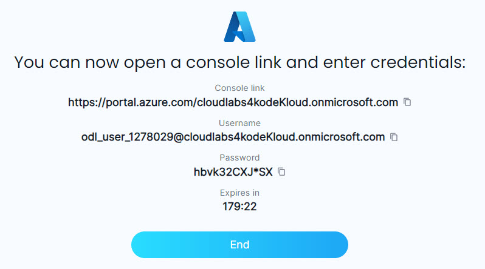
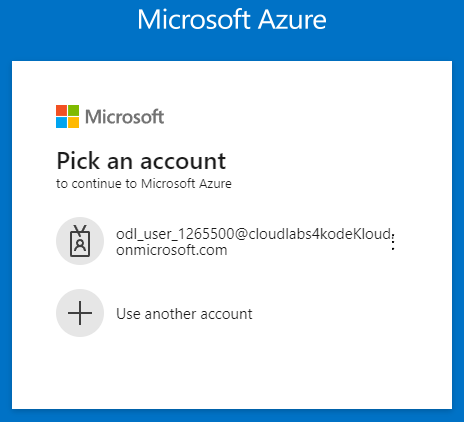

# Provision lab

Last updated: March 2024

### Provision your Azure playground lab

Prerequisite: Premium KodeKloud subscription

Access this link: https://kodekloud.com/playgrounds/playground-azure and click `START LAB` to request a new Azure Playground instance. After a few seconds, you will receive your temporary Azure portal account like this:

Copy the **Console Link** by pressing the copy button to the right of it, paste to your browser and sign in with the given credentials. If you are given a choice of accounts like in the following dialog, select **Use another account**

Skip all the usage and Start a Tour stuff, unless you're interested in that.

Next: [Creating the Service](./02-create-service.md)

