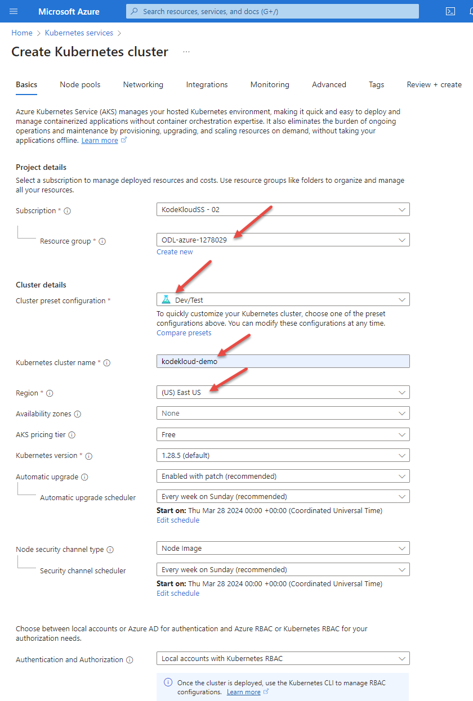

# Configure Cluster

Now fill in the configuration form

### Project Details

| Field | Value |
|-------|-------|
| Subscription | *Leave unchanged* |
| Resource Group | From the drop-list choose the only available option, which starts with `ODL-azure` |

### Cluster Details

Set the following fields. Leave all others unchanged

| Field | Value |
|-------|-------|
| Cluster preset configuration | `Dev/Test` |
| Kubernetes Cluster Name | `kodekloud-demo` |
| Region | `(US) East US` |

Next: [Node Pools](./05-node-pools.md)