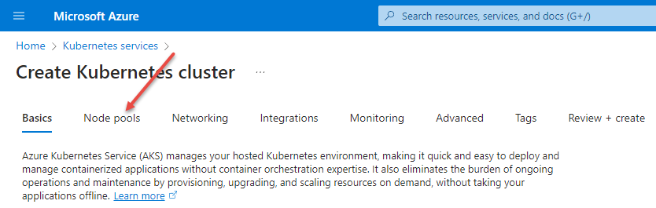
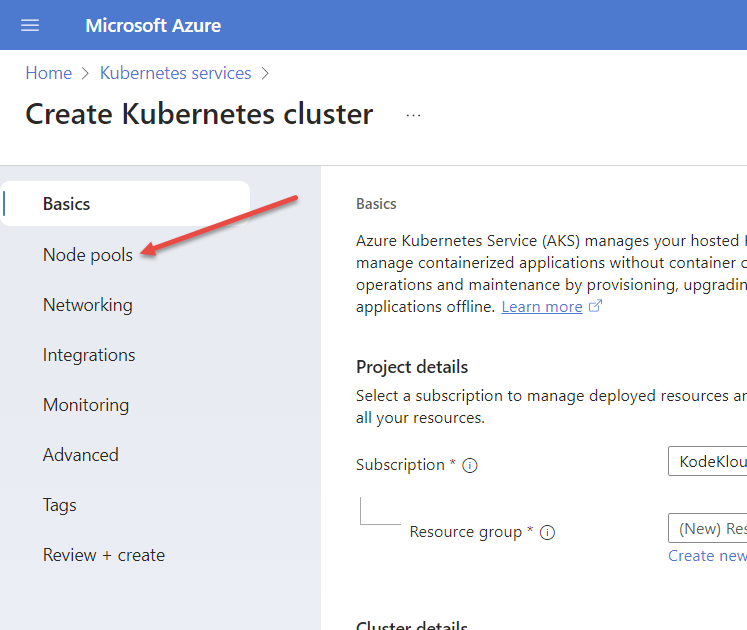
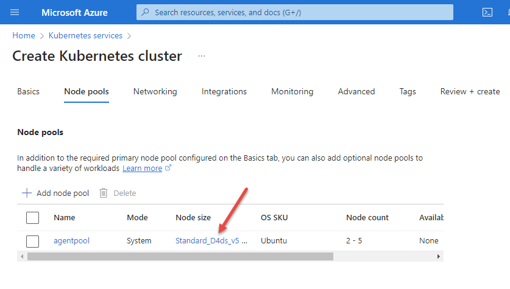
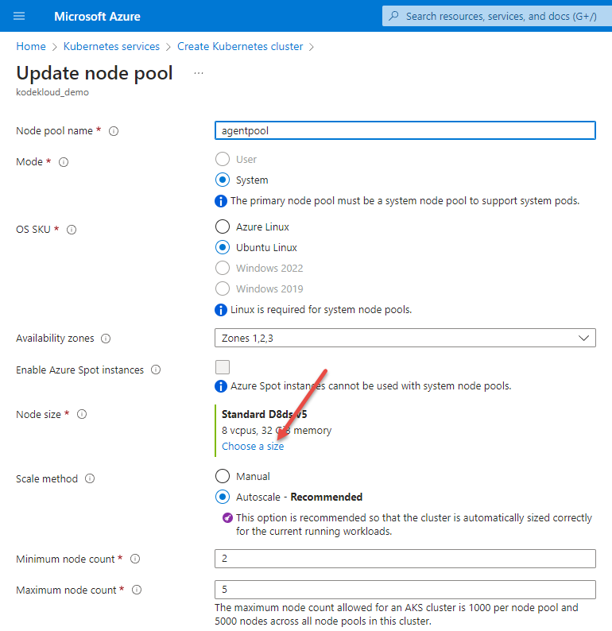
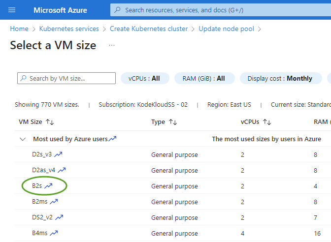

# Node Pools

1. Select **Node Pools** from the tab strip at the top.

    

    Note that this menu may also appear on the left:

    

1. To comply with playground restrictions, we need to change some configuration. Click on the value in the **Node size** column...

    

1.  You are now in the **Update Node Pool** screen

    1. Click on **Choose a size**

        

        And from the selection screen, choose `D4s_v3`

        

        Press the `Select` button that appears at the bottom of the screen to return to **Update Node Pool**.

    1. Next to **Scale Method** click in `Manual` radio button, then change **Node count** to `2`

    1. Press the `Update` button at the bottom of the screen to complete pool configuration.

Next: [Networking](./06-networking.md)

