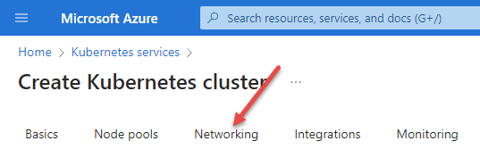
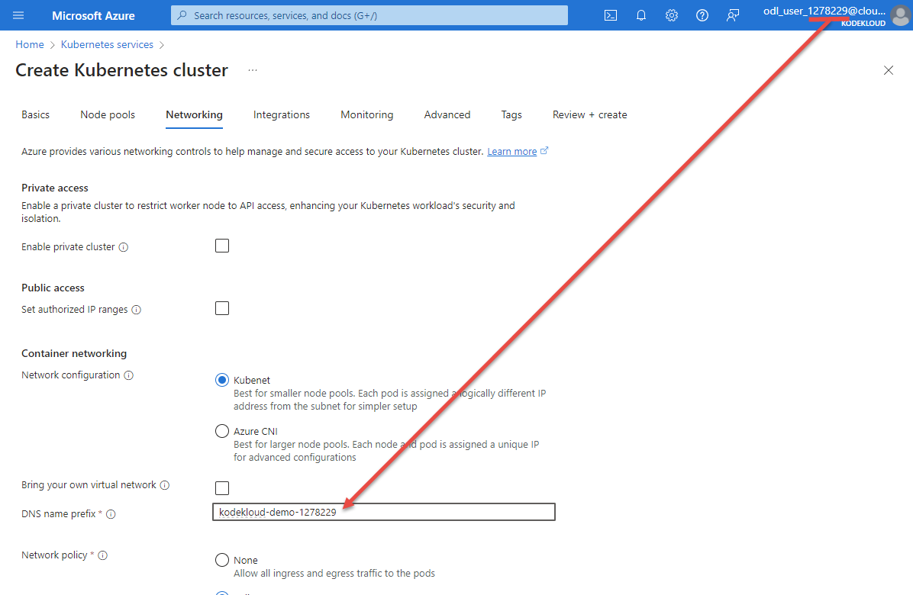

# Networking

Now move on to the networking section

Here we are required to set a DNS prefix. DNS prefixes should be globally unique, and you never know if somebody else is following this guide at the same time as you! Thus we cannot use a fixed name here.

We can create a unique enough name by using `kodekloud-demo-` followed by the digits of the login ID you were given by the lab.

Leave all other settings as default.

Next: [Monitoring](./07-monitoring.md)
