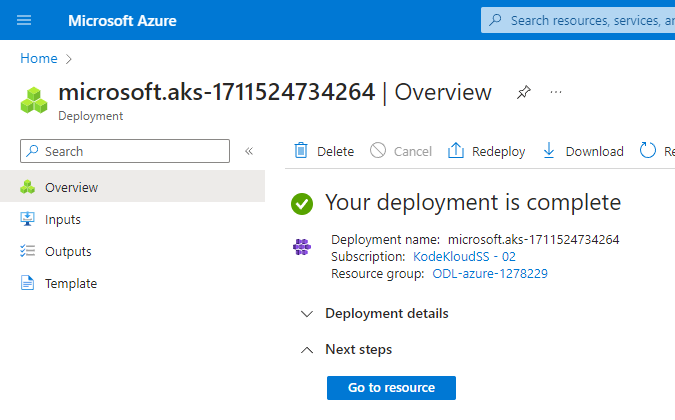

# Review and Create

Press the `Review and Create` button at the bottom of the browser window. It should think about it for a few seconds then produce a summary screen with a `Create` button at the bottom.

Press the `Create` button. It will take several minutes to provision, so go and make tea/coffee :smile:!

When it completes, you should see this

Click on `Go to resource`

You may see an error similar to the following, but it is an expected issue in the Azure Playground and doesn’t impact any AKS features, so just ignore it.

> The client 'odl_user_1278229@cloudlabs4kodeKloud.onmicrosoft.com' with object id 'da188846-792f-40be-8c62-ed65018e3a6e' does not have authorization to perform action 'Microsoft.Resources/subscriptions/resourceGroups/read' over scope '/subscriptions/1ca63aff-186a-4e2b-b3bc-f7dddf1d8969/resourceGroups/MC_ODL-azure-1278229_kodekloud-demo_eastus' or the scope is invalid. If access was recently granted, please refresh your credentials.

Next: [Connect to Cluster](./09-connect.md)

