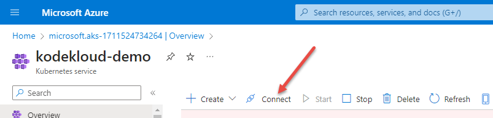
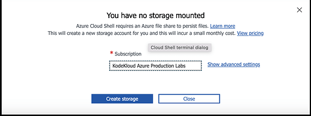
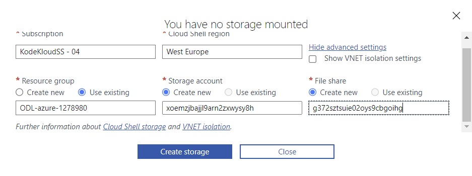
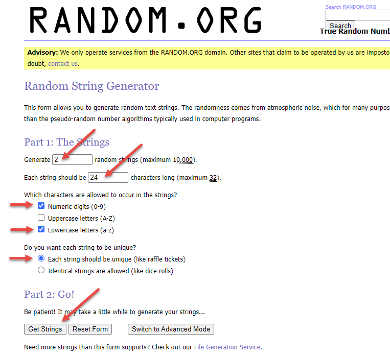

# Connect to Cluster

We will connect to the cluster using the Azure CloudShell.



When you click on **Connect**, it will pop up a window to the right. Click on the **Open Cloud Shell** link, then select `bash` as the shell. You will now be asked to create a storage account.



Click on the link **Show advanced settings** to get to here:



Fill in this form as follows

| Field | Value |
|-------|-------|
| Subscription | *Leave as default* |
| Cloud SHell Region | `East US` |
| Resource Group | `Use Existing` radio button |
| Storage Account | `Create new` radio button, then create a unique name for it and put in text box |
| File Share | `Create new` radio button, then create a unique name for it and put in text box |

Unique names should be 24 characters long consisting of number and lower case letters only You can use [this online tool](https://www.random.org/strings/) to create your unique names.



Copy your random strings into the form and press **Create Storage**

The cloud shell window will open at the bottom of your browser window and will automatically run the two commands that were listed in the pop-up.


Now you can run commands against the cluster, and you're done!

```text
odl_user [ ~ ]$ kubectl get nodes
NAME                                STATUS   ROLES   AGE   VERSION
aks-agentpool-33115789-vmss000000   Ready    agent   27m   v1.28.5
aks-agentpool-33115789-vmss000001   Ready    agent   26m   v1.28.5
odl_user [ ~ ]$ kubectl run nginx --image=nginx
pod/nginx created
odl_user [ ~ ]$ kubectl get pods
NAME    READY   STATUS    RESTARTS   AGE
nginx   1/1     Running   0          8s
odl_user [ ~ ]$ 
```


