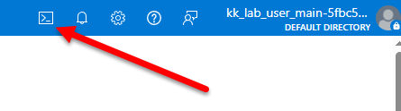

# Open Cloudshell

1. Press the CloudShell button at the top right

    
1. At the popup that opens, select `Bash`
1. At the next popup, select the following
    * Mount storage account
    * Subscription - select from the drop-down. There should be only one choice, something like `azurekmlprod`
    * Press `Apply`
1. At the `Mount Storage Account` popup, select `I want to create a storage account` and press `Next`
1. Now select the following from the `Create storage account` popup
    * `Subscription` - Do not change this.
    * `Resource gorup` - select from the drop-down. There should be only one choice.
    * `Storage account name` - Anything you like or random characters typed from your keyboard. At least 16.
    * `File share` - Anything you like or random characters typed from your keyboard. At least 16.
    * `Region` - Select `(US) East US` from the dropdown
    * Press `Create`, wait for it to deploy, then for the bash prompt to appear.

Next: [Install Terraform](./03-install-terraform.md)