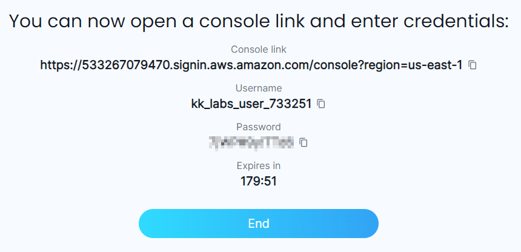
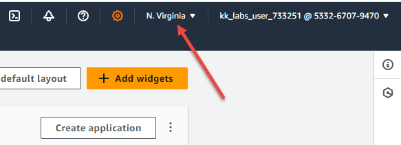

# Provision lab

Last updated: December 2024

Be aware that of the three managed cluster types, EKS is by far the most complicated to build as in the number of steps required to complete it. Please pay special attention to each, as if you make a mistake then you will see errors. *This does work* and when it doesn't, it will be because you missed something and you will probably be best ending the lab and starting over! Having said that, AWS do from time to time reorganize the console screens and workflow. If you find that what you see in the console deviates from what is in this guide, then please do call it out on Discord or the [Community Forum](https://kodekloud.com/community/c/kubernetes/6).

### Provision your AWS playground lab

Prerequisite: Premium KodeKloud subscription

Access this link: https://kodekloud.com/playgrounds/playground-aws and click `LAUNCH NOW` to request a new AWS Playground instance. After a few seconds, you will receive your temporary AWS portal account like this:

Copy the **Console Link** by pressing the copy button to the right of it, paste to your browser and sign in with the given credentials. At the login screen:
* Paste the given username to the `IAM user name` field.
* Paste the password to the `Password` field.
* Uncheck `Remember this account` checkbox if it is checked.
* Press `Sign in` button.

Once you have signed in, ensure the region is set to `us-east-1` (N. Virginia). If it is not displaying this, click on the region dropdown (indicated by arrow) and select `US East (N. Virginia) us-east-1` from the menu.

Next: [Creating the Service Role](./02-create-service-role.md)

