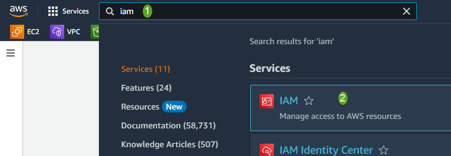
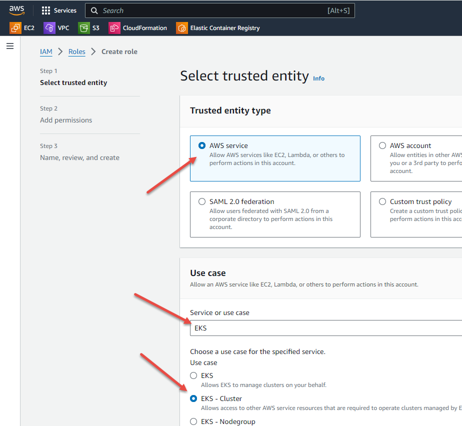
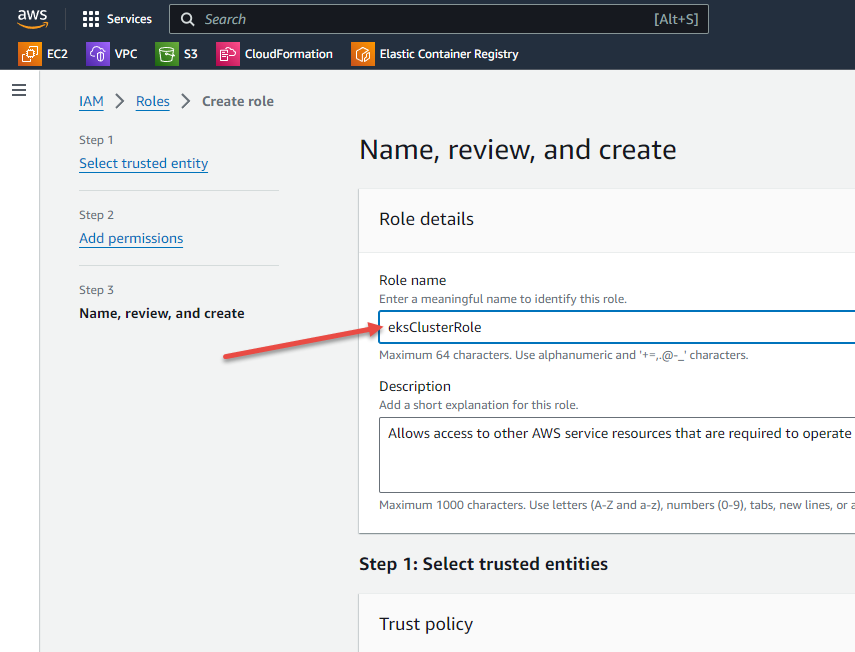

# Create the Service Role

Note that various information pop-ups may appear at the top of the console screen as you do things and may obscure other items. Dismiss these when they appear.

Before creating an EKS cluster you need to create a Cluster service IAM (Identity and Access Management) role. This grants permissions for the EKS service to access AWS APIs on your behalf.

1. Navigate to the IAM console
    1. Click in the search box and type `iam`
    1. Click on `IAM` in the result list

    

1. Click on `Roles` in the left menu
1. Click on orange `Create Role` button towards the top right
1. On the next screen `AWS Service` should be selected. If not, click on it to select.
1. In the `Use case` box, click on `Choose a service or use case` and type `eks`. EKS should come up in the list. Click on it.
1. In the list of radio buttons that will now appear, ensure `EKS - Cluster` is selected. It should now look like this:

    

1. Click on orange `Next` button at the bottom right. You may need to scroll down to get to it.
1. Press `Next` at the Add Permission screen. There are no additional permission required.
1. Finally name the role as `eksClusterRole`, scroll to end and press orange `Create role` button

    

Prev: [Sign in](./01-sign-in.md) 
Next: [Configure Cluster](./03-configure-cluster.md)