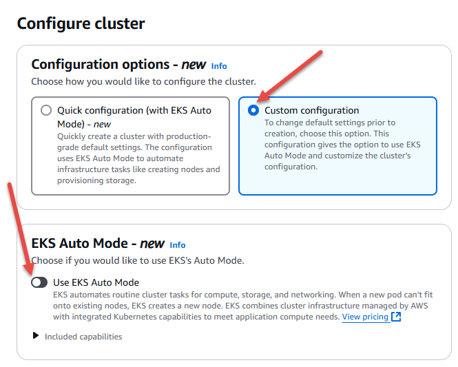

# Configure Cluster

Now we will configure the cluster options

1. Navigate to the EKS console
    1. Click in the search box and type `eks`
    1. Click on `Elastic Kubernetes Service` in the result list

    

1. Click on orange `Add cluster` button. This will open a list, and from that, choose `Create

    

1. In the Configure Cluster page, enter the name as `demo-eks` and select the cluster service role created above. Then scroll to the end and press `Next` button.

    

Prev: [Create Service Role](./02-create-service-role.md) 
Next: [Networking](./04-networking.md)

