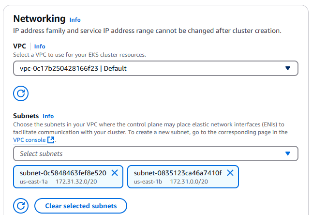

# Networking

1. Select VPC - there should only be one choice, the Default VPC.

1. Select values for the Subnets fields. There needs to be at least two subnets selected. ad we don't need more than 3. Ensure that `us-east-1e` is *not* one of the selected subnets.

    

1. Scroll to end and press `Next`.
1. At the following page (Observability), press `Next` again as there is nothing to do here.
1. At the following page (Select add-ons), press `Next` again as there is nothing to do here either.
1. At the following page (Configure selected add-ons settings), press `Next` again as there is nothing to do here either.

Prev: [Configure Cluster](./03-configure-cluster.md) 
Next: [Create Cluster](./05-create-cluster.md)

