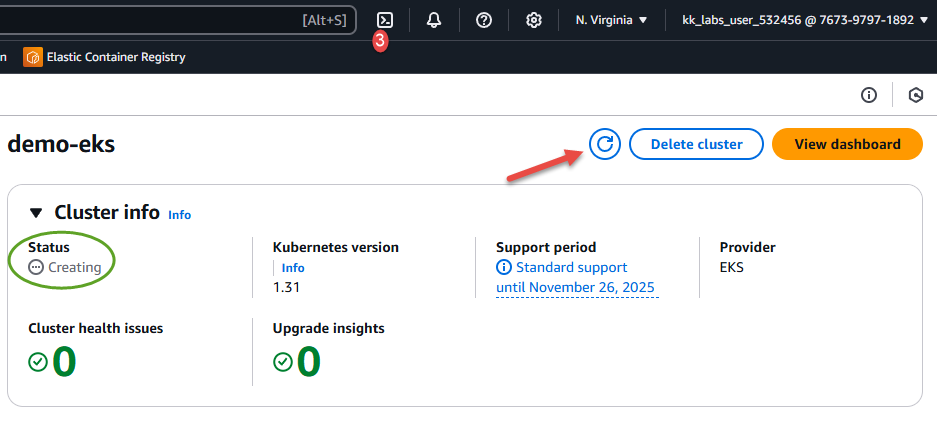

# Create Cluster

Now you should be on the Review and Create page. Here we will launch the control plane. No nodes are ready yet - this comes later.

1. Review the information that you entered or selected on the previous pages. If you need to make changes, choose an `Edit` button next to the section you want to change. After that, scroll to the end and press `Create`. The Status field shows "Creating" while the cluster is provisioned. This will take *at least* 10 minutes, so go and make a cup of tea! You may need to press the refresh button periodically (indicated by arrow) to ensure the information is up to date.

1. Wait for the control plane to deploy. When the control plane is deployed, the status will change from "Creating" to "Active"

    

1. **IMPORTANT**: if you are building the cluster as part of a lab or KKE task, you must enter all the following commands at the *lab* terminal, not CloudShell, or the grader will not be able to connect to your cluster.<br/><br/>Once the cluster is created, enable kubectl to communicate with your cluster by adding a new context to the kubectl config file by executing the following command in CloudShell, which you can invoke by pressing the cloudshell button indicated by the number `3` in the image above. This will open a cloudshell prompt below the EKS console into which you can paste and run the following:

    ```
    aws eks update-kubeconfig --region us-east-1 --name demo-eks
    ```

    Check it is connecting. You should see some resources. All pods are in Pending state because we have yet to create nodes to run them on.

    ```
    kubectl get all -A
    ```

Prev: [Networking](./04-networking.md)<br/>
Next: [Add nodes](./06-nodes.md)