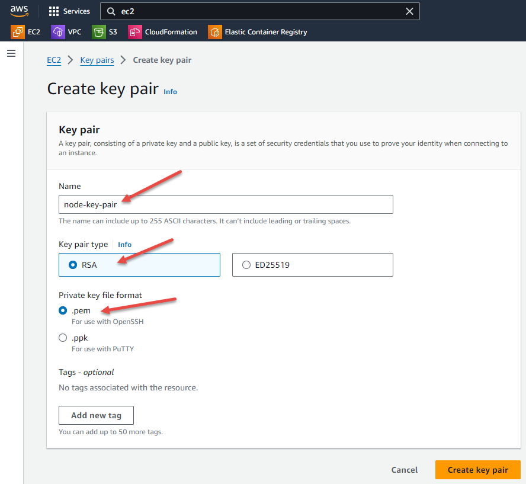
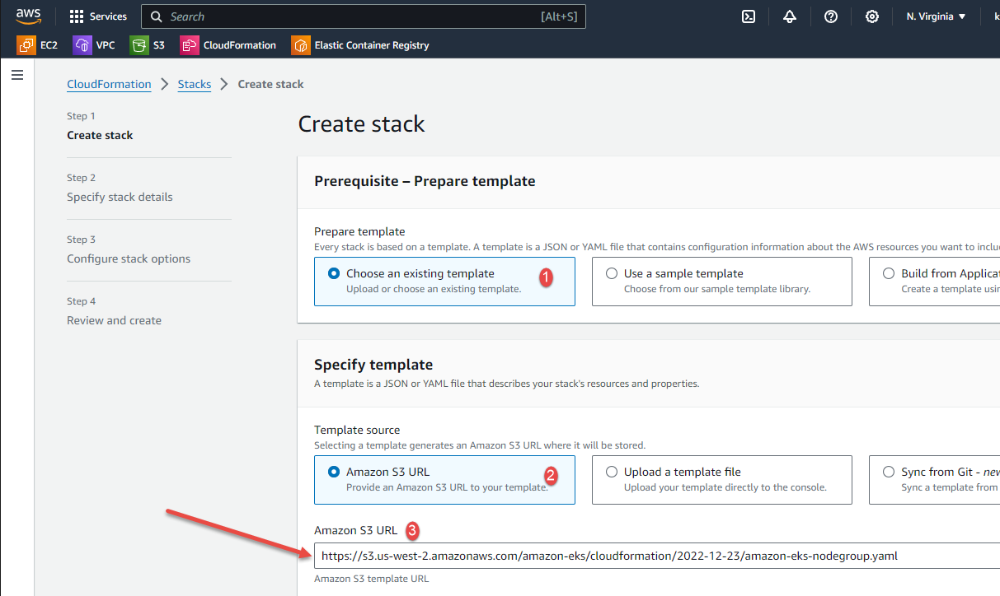
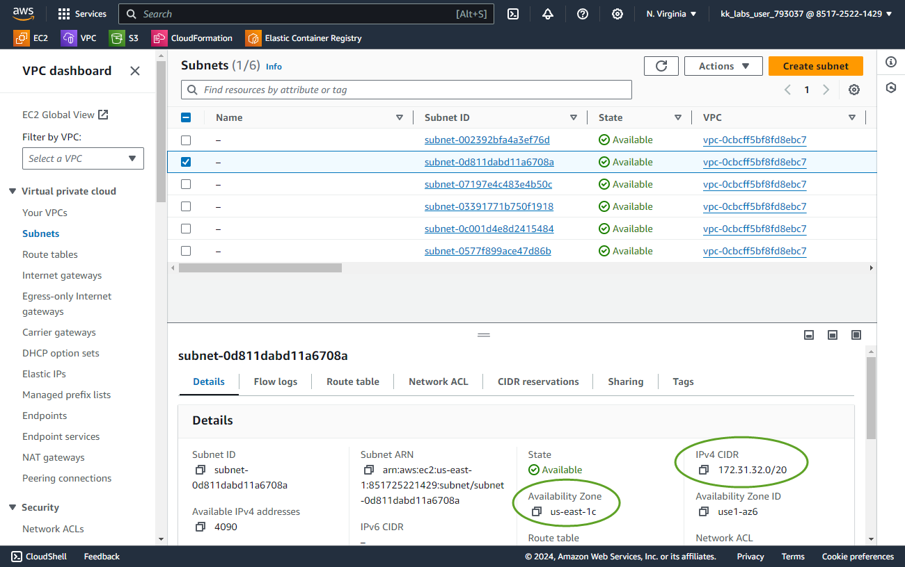
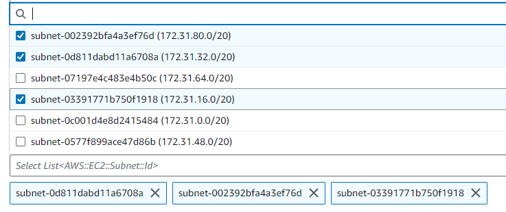
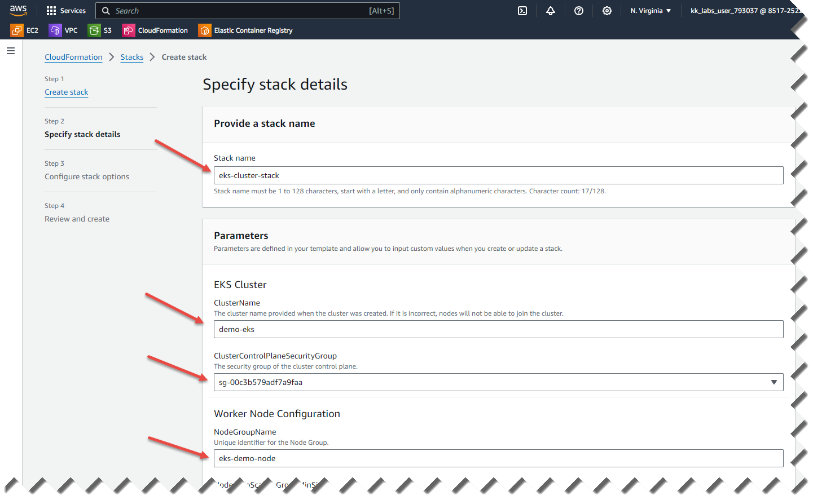
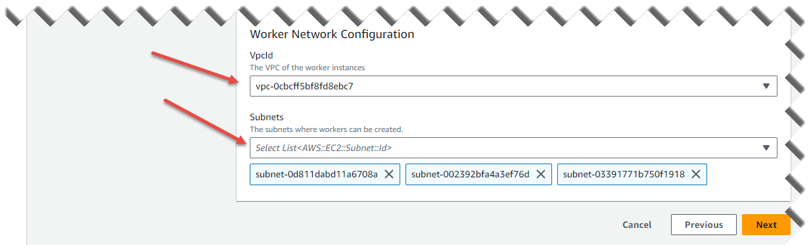
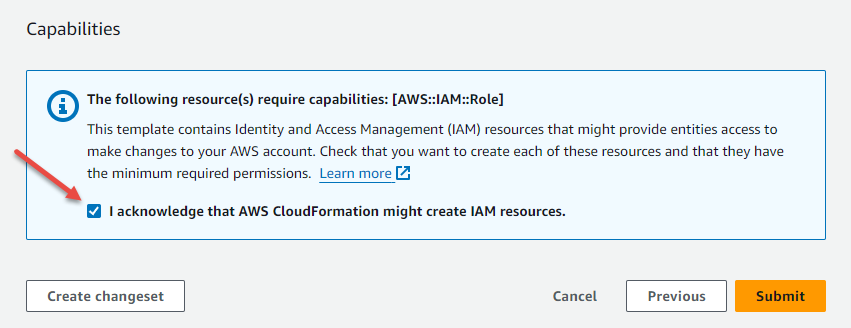
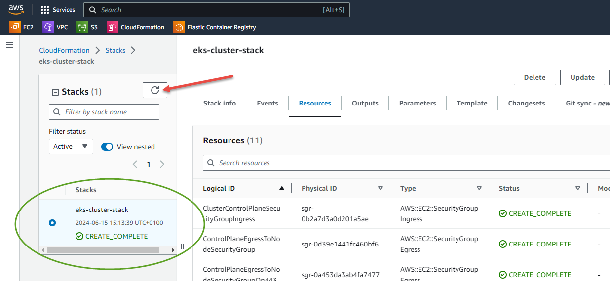
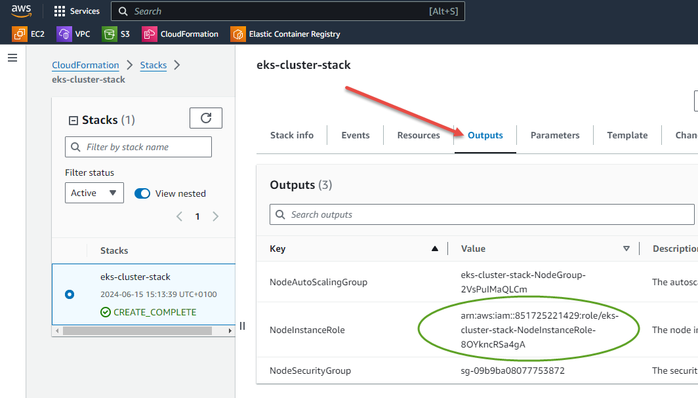

# Add Cluster Nodes

Now we will add some *unmanaged* nodes to the cluster. AWS Playground does not support managed node groups.

1. Create an SSH keypair for the nodes to use
    1. Navigate to the EC2 console by typing `ec2` in the search box at the top, and then selecting it from the list.
    1. Scroll down the menu on the left until you see `Key Pairs`, then click that to enter the key pairs console.
    1. Click the orange `Create key pair` button at the top right
    1. Fill out the form using `node-key-pair` as name, `RSA` as key pair type and `.pem` as private key format

        

    1. Press the `Create key pair` button

1. Navigate to the CloudFormation console, again using the search box. CloudFormation is AWS's native Infrastructure as Code, and we will use a pre-prepared template to define worker nodes.
    1. Press the orange `Create stack` button
    1. Select Choose an existing template from Amazon S3 URL and use the following URL: `https://s3.us-west-2.amazonaws.com/amazon-eks/cloudformation/2022-12-23/amazon-eks-nodegroup.yaml`

        

    1. Scroll to end of page and press `Next`

1. Now we fill in the parameters required to deploy the nodes
    1. `Stack Name`: `eks-cluster-stack`
    1. `ClusterName`: `demo-eks`
    1. `ClusterControlPlaneSecurityGroup`: Click in the box and select the one with a name that contains `eks-cluster-sg`
    1. `NodeGroupName`: `eks-demo-node`
    1. `KeyName`: (you will likely need to scroll down to find this) - `node-key-pair` as created above.
    1. `VpcId`: Click in the box and select the only entry that is there
    1. `Subnets`. Sadly the drop-list does not show the AZ of the nets so it is fiddly to determine which ones to select
        1. Open the [subnets console](https://us-east-1.console.aws.amazon.com/vpcconsole/home?region=us-east-1#subnets:) in another browser tab or window.
        1. Click on each subnet to view its information in the lower pane.
        1. Note the IPv4 CIDR for the ones that are in the subnets you selected when configuring cluster networking.

            

        1. Choose these subnets back in the cloudformation console

            

    1. Leave other settings as defaults

    It should now look something like this

    

    

1. Press `Next`
1. Nothing to do on the following screen. Scroll to end and press `Next`
1. Now you are on the final screen. Scroll to the end and check the acknowledge box, then press `Submit`

    

1. Wait for stack creation to complete which will take a few minutes. You may need to press the Refresh button a few times until it gets to `CREATE COMPLETE`

    

1. Now select the `Outputs` tab and note down the value of `NodeInstanceRole`. You need this when you join your Amazon EKS nodes.

    

Prev: [Create Cluster](./05-create-cluster.md) 
Next: [Join Worker Nodes](./07-join-nodes.md)

