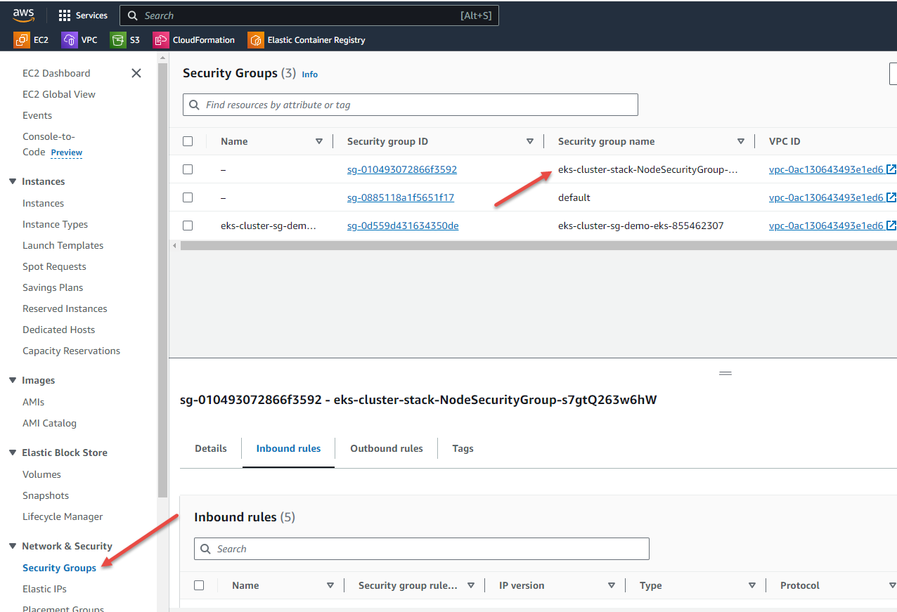
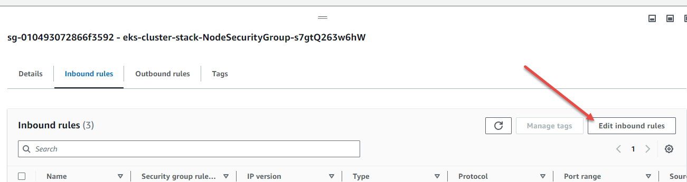
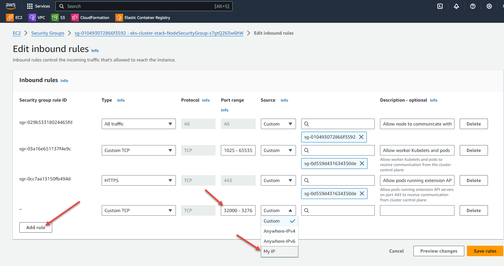
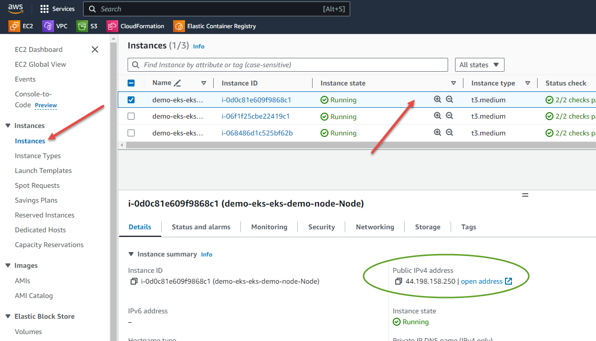

# Amazon EKS Cluster

In this guide, we will deploy an EKS cluster in the KodeKloud AWS Playground using Terraform. This cluster utilises an *unmanaged* node group, i.e. one we have to deploy and join manually as the playground does not support the creation of managed node groups.

If you want to do this manually from the AWS console, you can follow [this guide](../console/README.md).

This terraform code will create an EKS cluster called `demo-eks` and will have the same properties as the manually deployed version linked above.

## Start an AWS Playground

[Click here](https://kodekloud.com/playgrounds/playground-aws) to start a playground, and click `START LAB` to request a new AWS Cloud Playground instance. After a few seconds, you will receive your credential to access AWS Cloud console.

Note that you must have KodeKloud Pro subscription to run an AWS playground. If you have your own AWS account, this should still work, however you will bear the cost for any resources created until you delete them.

This demo can be run from either your own laptop or from the AWS cloudshell
* From your laptop
    * You must have working versions of [terraform](https://developer.hashicorp.com/terraform/install), [kubectl](https://kubernetes.io/docs/tasks/tools/#kubectl) and the [AWS CLI](https://docs.aws.amazon.com/cli/latest/userguide/getting-started-install.html#getting-started-install-instructions) installed on your laptop. This is not a tutorial on how to install these things.
    * You will need to go to the IAM console in AWS, then create and download access keys for the playground user, then export these as `AWS_ACCESS_KEY_ID` and `AWS_SECRET_ACCESS_KEY` in your terminal's environment.
* From CloudShell
    * No special requirements.
    * CloudShell is a Linux terminal you run inside the AWS console and has most of what we need preconfigured. [Click here](https://us-east-1.console.aws.amazon.com/cloudshell/home?region=us-east-1) to open CloudShell.

From here on, all commands must be run at the terminal (your own or CloudShell) as chosen above.

## Install Terraform

If using CloudShell, this is a required step. If using your laptop, we assume you have already installed terraform.

```bash
terraform_version=$(curl -s https://checkpoint-api.hashicorp.com/v1/check/terraform | jq -r -M '.current_version')
curl -O "https://releases.hashicorp.com/terraform/${terraform_version}/terraform_${terraform_version}_linux_amd64.zip"
unzip terraform_${terraform_version}_linux_amd64.zip
mkdir -p ~/bin
mv terraform ~/bin/
terraform version
```

## Clone this repo

```bash
git clone https://github.com/kodekloudhub/certified-kubernetes-administrator-course.git
```

Now change into the EKS terraform directory

```bash
cd certified-kubernetes-administrator-course/managed-clusters/eks/terraform
```

## Provision the infrastructure

```bash
terraform init
terraform plan
terraform apply
```

This may take up to 10 minutes to complete. When it completes, you will see something similar to this at the end of all the output. You will need the value of `NodeInstanceRole` later.

```
Outputs:

NodeAutoScalingGroup = "demo-eks-stack-NodeGroup-UUJRINMIFPLO"
NodeInstanceRole = "arn:aws:iam::387779321901:role/demo-eks-node"
NodeSecurityGroup = "sg-003010e8d8f9f32bd"
```

## Set up access and join nodes

Do the following at the CloudShell command line

1.  Create a KUBECONFIG for `kubectl`

    ```bash
    aws eks update-kubeconfig --region us-east-1 --name demo-eks
    ```

1.  Join the worker nodes

    1. Download the node authentication ConfigMap

        ```
        curl -O https://s3.us-west-2.amazonaws.com/amazon-eks/cloudformation/2020-10-29/aws-auth-cm.yaml
        ```

    1.  Edit the ConfigMap YAML to add in the `NodeInstanceRole` we got from terraform

        ```bash
        vi aws-auth-cm.yaml
        ```

        Delete the text `<ARN of instance role (not instance profile)>` and replace it with the value for `NodeInstanceRole` we got from terraform, then save and exit.

        ```yaml
        apiVersion: v1
        kind: ConfigMap
        metadata:
        name: aws-auth
        namespace: kube-system
        data:
        mapRoles: |
            - rolearn: <ARN of instance role (not instance profile)> # <- EDIT THIS
            username: system:node:{{EC2PrivateDNSName}}
            groups:
                - system:bootstrappers
                - system:nodes

        ```

    1.  Apply the edited ConfigMap to join the nodes

        ```bash
        kubectl apply -f aws-auth-cm.yaml
        ```

        Wait 2-3 minutes for node join to complete, then

        ```bash
        kubectl get node -o wide
        ```

        You should see 3 worker nodes in ready state. Note that with EKS you do not see control plane nodes, as they are managed by AWS.

1.  View the completed cluster in the [EKS Console](https://us-east-1.console.aws.amazon.com/eks/home?region=us-east-1).

## Access a service

To view a running service in your browser, you need to take the following steps

### Edit Node Security Group

If you created the cluster directly from your own laptop, skip to the next section - [Deploy a Service](#deploy-a-service).

The node security group for the cluster nodes grants access to the CloudShell terminal. It does not know about your laptop. At this stage it would be possible to create a NodePort service and access it using `curl` from the Cloudshell terminal. In order to hit nodes from your laptop's browser we need to add the public IP for your broadband to the node security group.

1. Navigate to the EC2 console using the search box.
1. In the menu on the left, scroll down till you find `Security groups` and click on it.
1. In the list of security groups, click on the `NodeSecurityGroupIngress`. Note that this image is shared with the Console version of this guide where the name is slightly different. Key point is it is the nodes' security group.

    

1. In the lower pane that appears, click on `Edit inbound rules`.

    

1. On the edit rules page that now comes up, click on `Add Rule` button which is at the end of the `Inbound Rules` list.
1. Fill in the new security group rule
    * `Type`: `Custom TCP`
    * `Port range`: `30000 - 32768` which is the default range for node ports as you should know from the course.
    * `Source`: `My IP` It will automatically determine your broadband public IP. You can find this yourself by browsing http://checkip.amazonaws.com

    

1. Press the orange `Save rules` button.

### Deploy a Service

1. In the AWS console, navigate to `Instances` in the menu on the left and click on it
1. Note the `Public IP` addresses of the nodes. You will need to use any one of these to connect to your nodeport service.

    

1. Return to your terminal (CloudShell or laptop as appropriate) and create a service

    1. Create pod and service

        ```
        kubectl run nginx --image nginx --expose --port=80
        ```

    1. Edit the service and change it to nodeport.

        ```
        kubectl edit service nginx
        ```

        Make the manifest look like this (I have only shown the relevant sections of the service manifest here)

        ```yaml
        ports:
        - port: 80
          protocol: TCP
          targetPort: 80
          nodePort: 30080       #<- Add this
        selector:
          run: nginx
        sessionAffinity: None
        type: NodePort          #<- Edit this from ClusterIP to NodePort
        ```

1. Now you can view your service in your browser by building the URL from the public IP address you got from the EC2 console, and the node port `30080`. In this example it is `http://44.198.158.250:30080`, but for you the IP address will be different. Paste the URL you have formed into your browser. You should see the nginx welcome page.

