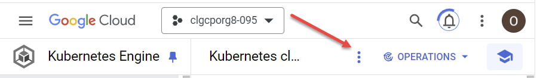
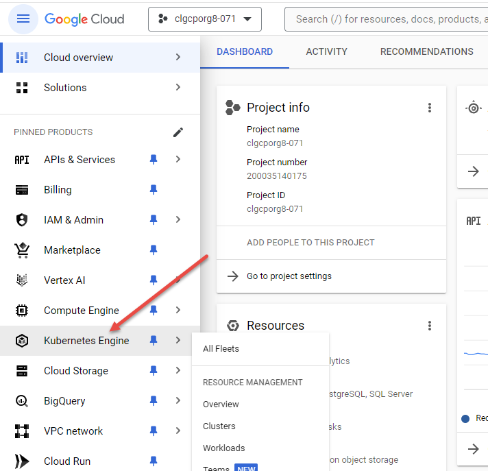
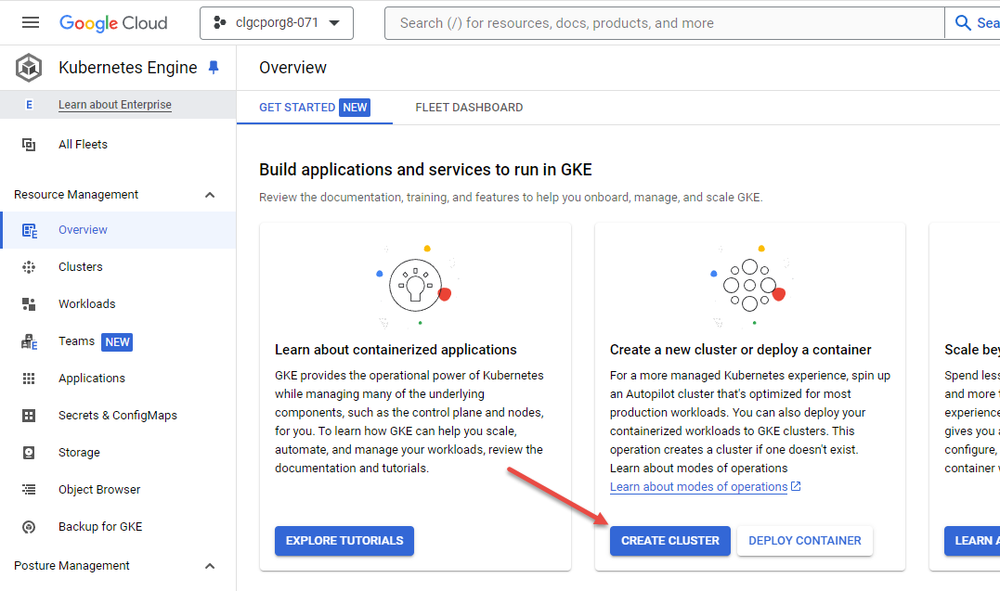
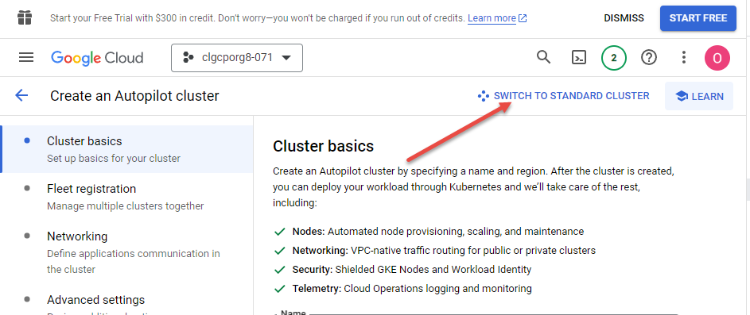
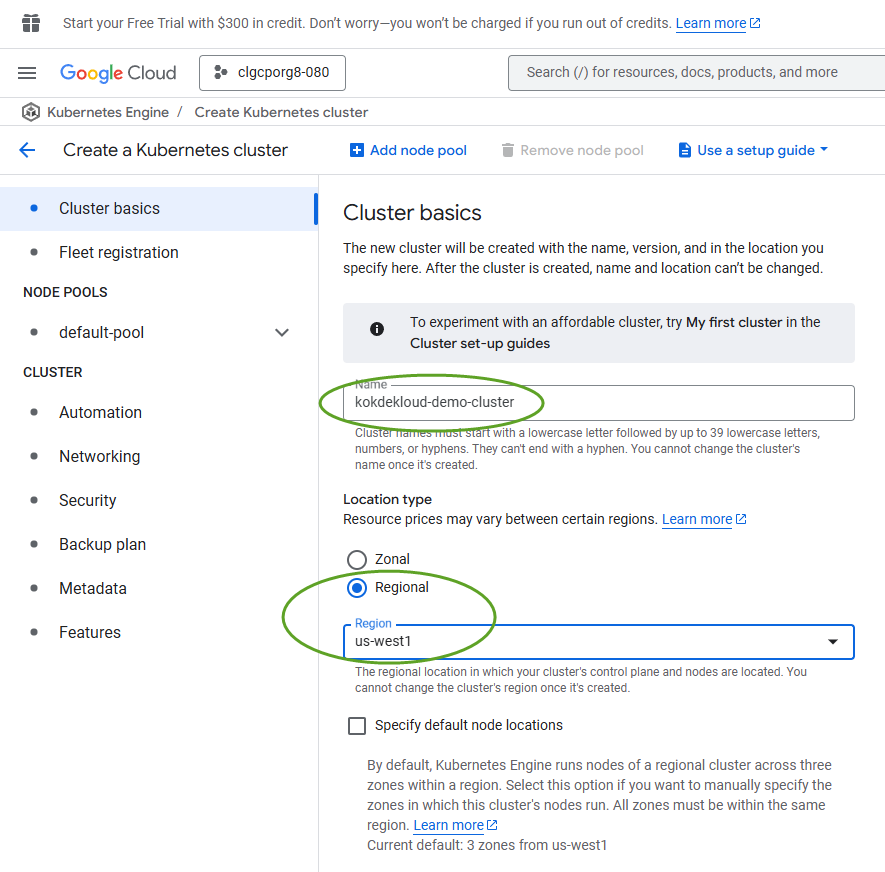

# Provisioning the Cluster

There is no longer any need to select project, or set up routes or firewall rules as directed by the [original guide published on the Community Forum](https://kodekloud.com/community/t/playground-series-how-to-create-a-managed-kubernetes-cluster-with-google-kubernetes-engine/230314). These are now all in place when you start, therefore you can get straight onto configuring the cluster.

Note that as you navigate around the GCP site, various blue information pop-ups may appear. Dismiss these if they do.

If using a small monitor, some top menu items may be hidden behind a vertical ellipsis - `⋮`. Check for this if some options shown in the screenshots can't be found.  

1. In the menu on the left, select `Kubernetes Engine`. You don't need to select any item from the submenu that pops up.  
1. On the following screen, press the `CREATE CLUSTER` button. You will arrive at the Cluster Basics screen.  
1. Near the top right of this screen, click on `SWITCH TO STANDARD CLUSTER`, and confirm this is what you want to do in the dialog that pops up  
1. Edit the cluster name as shown below. Other names *should* be ok, but if you have issues, use this one. Leave all other fields as defaults   

We've started configuring the cluster, but still have additional things we need to set, so don't click the CREATE button at the bottom of this screen just yet.  Before that, we'll configure the node pool on the next page...

Prev: [Sign in](./01-sign-in.md) 
Next: [Node Setup](./03-node-setup.md)
