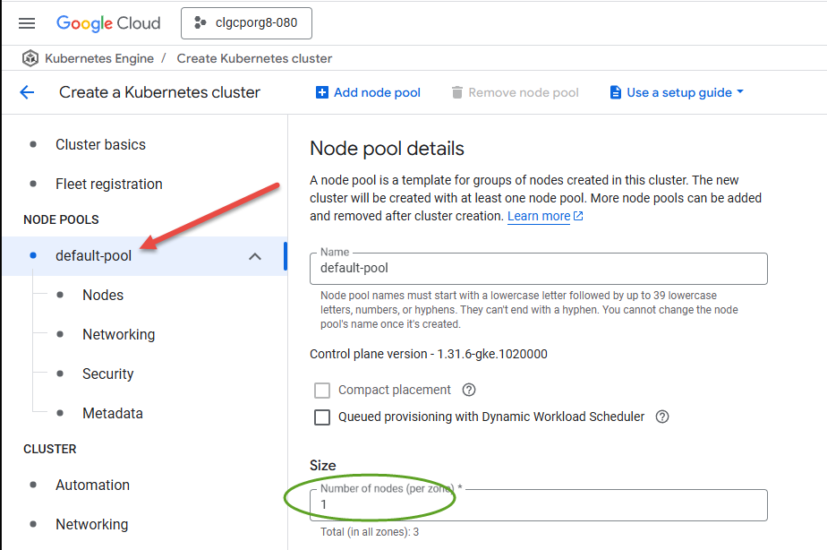
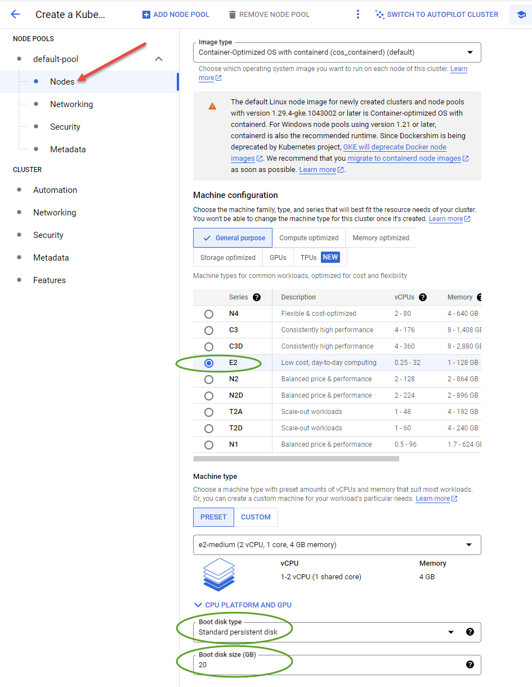
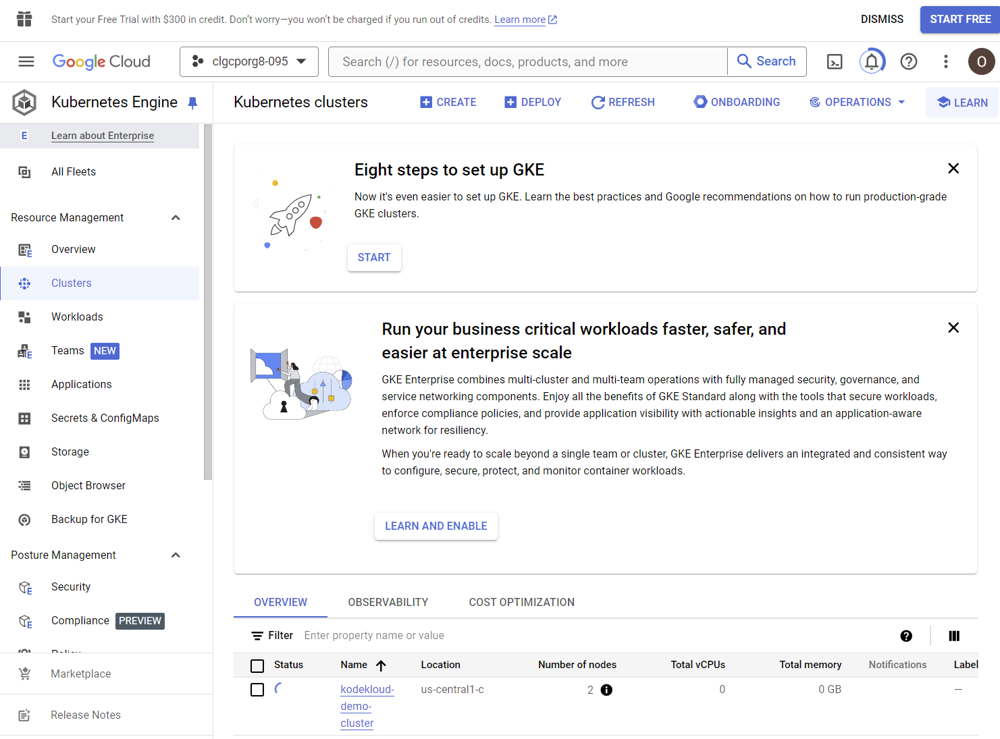

# Node Setup

1. Click on `NODE POOLS/Default Pool` to the left. Set `Number of nodes` to `2`. Leave all other fields as defaults.   
1. Click on Nodes. Ensure `Machine Configuration` is set to `E2`. Set `Boot disk type` to `Standard persistent disk` and `Boot disk size` to `20`  

The more advanced features of GKE aren't enabled in KodeKloud playgrounds, so there is no more configuration needed. Thus you are now ready to go! Press the `CREATE` button at the bottom of this screen. It will take at least 5 minutes to deploy your new cluster. It will take you to this screen. You may have to sacroll it down to see the cluster at the bottom.

Prev: [Provisioning Cluster](./02-create-cluster.md) 
Next: [Connect to Cluster](./04-connect.md)

