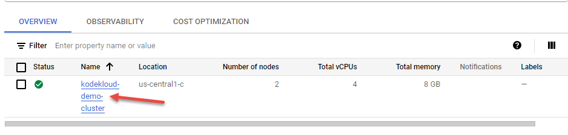
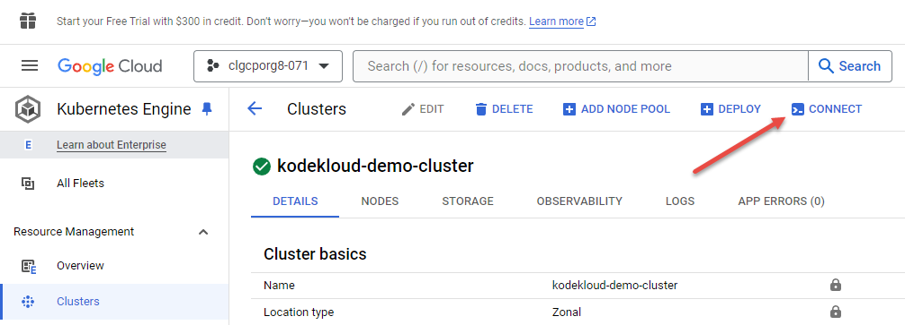
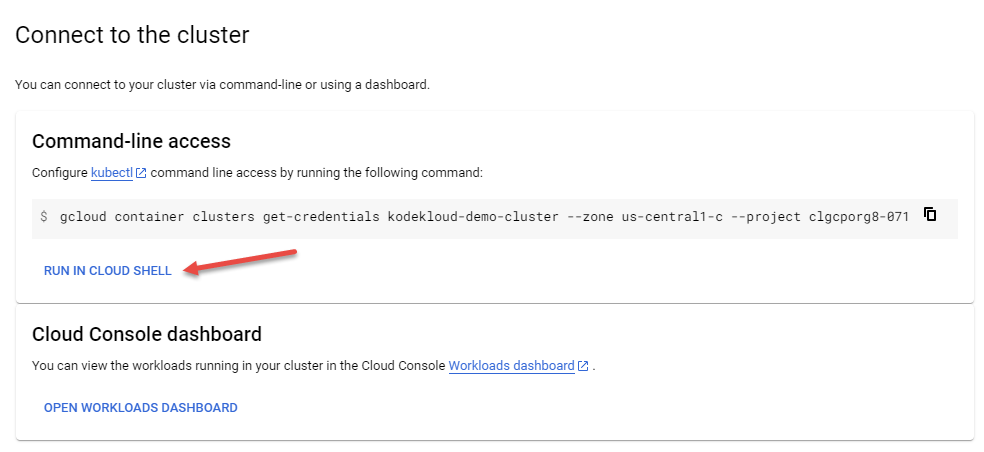
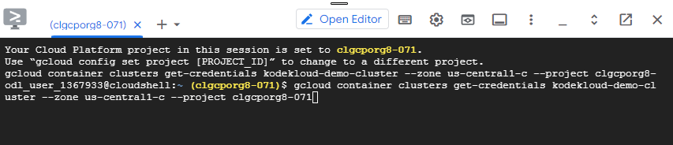

# Connect to Cluster

1. When the cluster has deployed, then there will be a green tick in the status column. You can now click on the cluster name<br/><br/>
1. At the top of the following screen, click on `CONNECT`<br/><br/>
1. Click on `RUN IN CLOUDSHELL`. The CloudShell pane will open at the bottom of the screen. Press the `CONTINUE` button.<br/><br/>
1. The terminal will open and some commands will appear in it, Hit `ENTER` to execute them. Press `AUTHORIZE` on the dialog that pops up.<br/><br/>
1. Test with `kubectl`

    ```text
    kubectl get pods -A
    ```


