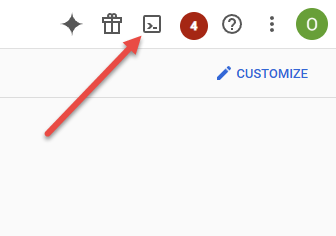

# Install Terraform

Here we will install terraform and pull the configuration we are going to use down from Github.

## Open Cloudshell

First, open the Cloudshell by clicking on the icon at the top right of the dashboard. A Linux terminal will open at the bottom of the screen.



Perform the following commands in the Cloudshell terminal

## Install terraform

```bash
terraform_version=$(curl -s https://checkpoint-api.hashicorp.com/v1/check/terraform | jq -r -M '.current_version')
curl -O "https://releases.hashicorp.com/terraform/${terraform_version}/terraform_${terraform_version}_linux_amd64.zip"
unzip terraform_${terraform_version}_linux_amd64.zip
mkdir -p ~/bin
mv terraform ~/bin/
terraform version
```

# Clone the repository

```bash
git clone https://github.com/kodekloudhub/certified-kubernetes-administrator-course.git
cd certified-kubernetes-administrator-course/managed-clusters/gke/terraform
```

Next: [Deploy Cluster](./03-deploy-cluster.md)</br>
Prev: [Sign in](./01-sign-in.md)
